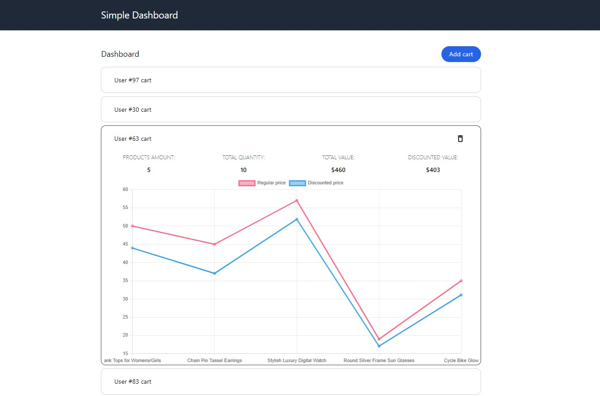

# simple-dashboard




## How to run this app

1. Clone this repository:
```
gh repo clone BlackH3art/simple-dashboard
```

2. Install dependencies:
```
npm install
```

3. Now you can run the app with:
``` 
npm run dev
```
